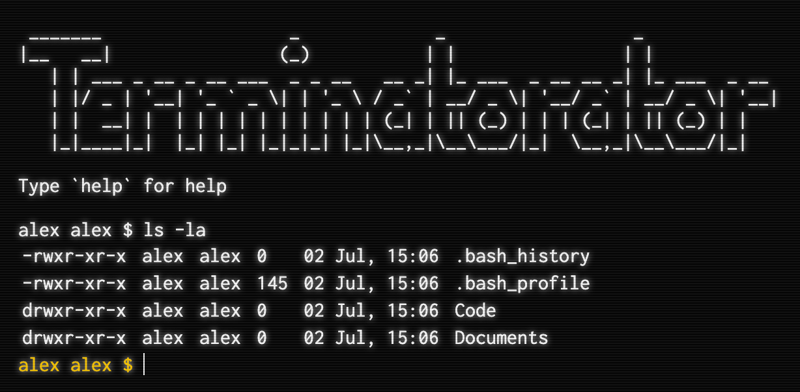

# Terminatorator

> A browser based terminal for your webapp.



## How to use

Add a div to your web page hold the terminal:

```html
<div id="terminal"></div>
```

Create the terminal:

```javascript
import {
  createTerminal
} from 'terminatorator'

createTerminal(document.getElementById('terminal'), {
  welcome: 'hello world', // will be printed on start
  theme: 'interlaced', // || 'modern' || 'white' - can be changed at runtime
    // using the `theme` command
  commands: {}, // see `Adding custom commands` below
  history: 'cli-history', // the localStorage key used to store terminal history
  user: 'alex' // which user to be logged in as
})
```

## Adding custom commands

```javascript
const myCommand = {
  handler: (args, session) => {
    // Do something with args and return either:
    //  - nothing
    //  - a string
    //  - a promise of a string
    //  - an Iterable of strings (e.g. an Array or other Symbol.iterator)
    //  - an async iterable of strings
  },
  args: {
    // The optional args object will be passed as the `opts` argument to yargs-parser.
    // See https://www.npmjs.com/package/yargs-parser#requireyargs-parserargs-opts
  }
}

createTerminal(document.getElementById('terminal'), {
  commands: {
    // the key is where in the fs the command should be mounted, the value is
    // the command as defined above
    '/usr/local/bin/my-command': myCommand
  }
})
```

Command handlers take two arguments - `args` and `session`.

### `args`

This is the output of [yargs-parser](https://www.npmjs.com/package/yargs-parser).

### `session`

A object contains the following keys:

```javascript
{
  env: {
    // key=value of environmental variables
  },
  commands: {
    // path=command of all available commands
  },
  api: {
    exec: (line, { hidden: false }), // call this function with a line of shell
      // input to execute commands, pass hidden: true if you do not wish the
      // command to be echoed to the screen or added to the history
    print: (line) // call this function to add output to the screen
  },
  fs: {
    // call functions here to manpiulate the filesystem directly
    getNode: (path, session), // return a fs node
    mkdir: (path, session, { uid, gid, perms, parents }), // create a directory
      // node with the passed uid, gid and perms - parents: true will created
      // intermediate directories
    write: (path, content, session, { uid, gid, perms, parents }), // create a
      // file node with the passed uid, gid and perms - parents: true will
      // created intermediate directories
    read: (path, session), // read file contents
    rm: (path, session, { recursive }) // remove an fs node
  }
}
```

## Acknowledgements

- Based on [dom-terminal](https://www.npmjs.com/package/dom-terminal) by [@sasadjolic](https://github.com/sasadjolic)

## What's in a name?

Big up Green Lungs and the Arachnid Egg Sac Crew in [Isleworth](https://en.wikipedia.org/wiki/Isleworth), easy.<br />
Big up Baron Bin Man, easy.<br />
Keep it locked on, Ursa Minor, easy.<br />
[Big up the Terminatorator, easy](https://youtu.be/3z9uLdARaNU?t=700).<br />
Big to Susan and Timothy in [Barnes](https://en.wikipedia.org/wiki/Barnes,_London), easy.<br />
Boi, you know it!<br />
I can't stop!<br />
<br />
T-WOG$ RIP.
